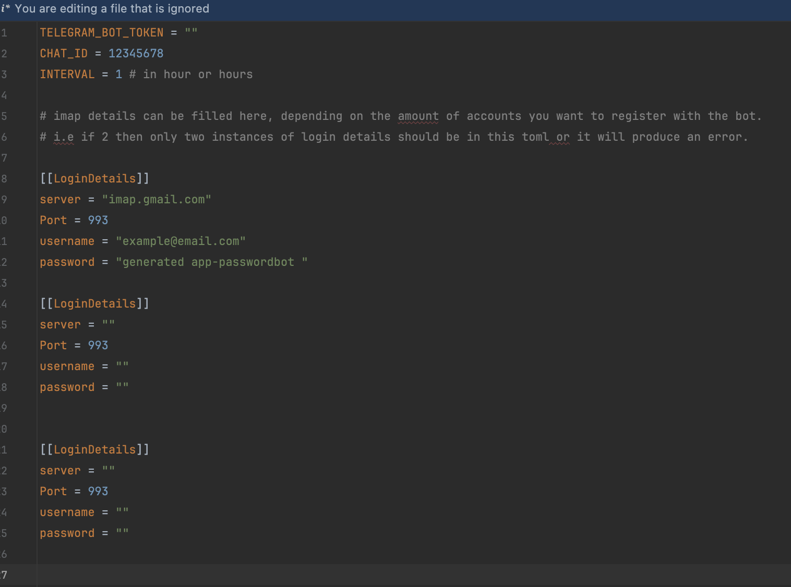

# CHECKEMAILBOT

> This project is an experimental project I am using to learn how to build telegram bots. It's safe to use for personal
> emails that supports IMAP version 4
> if it is deployed in a secure environment. It doesn't support Oauth2 yet and cant work with Office 365 emails or other
> email providers that won't allow IMAP Access.

Checkemailbot is a telegram bot I use for monitoring my email accounts.it checks all email accounts specified in
config.toml at the same time and returns the number of unread emails found in those accounts to telegram. You can
either check
the email using the bot commands on the telegram app or wait for the bot to check and send results notification at the
specified interval
time in config.

# Before Installation

Before installation. You need to create a config.toml file required by the program. This toml file has to be the same
with the example shown below



The Telegram bot token and chat ID should be created on the telegram using bot father. Please follow
this [link](https://www.youtube.com/watch?v=EOke01hZgZ0) for a detailed guide on how to do that
The bot handler that should be created are /start and /check respectively. The start handler gives a little information
about the program and the check handler can manually check all email accounts.

# Installation

## Download
> Best method for windows operating system users

Download the latest release for your cpu architecture from
the [releases page](https://github.com/6ogunt48/checkemailbot/releases) and extract the zip file.The program will run if
the config.toml file is in the same folder. if config is not in the same folder we can also parse the path to the config
file when starting the program.For example:

```bash
./checkemailbot-darwin-arm64 --config=/path/to/config/toml/file
```

## Build from source

You can also build the application from source by cloning the repository to your machine and running the following Make
command:

```bash
make build
```

This will create a `checkemailbot` executable file in the `/build` directory. You can run this file to start the
application. The config.toml file is also needed.


